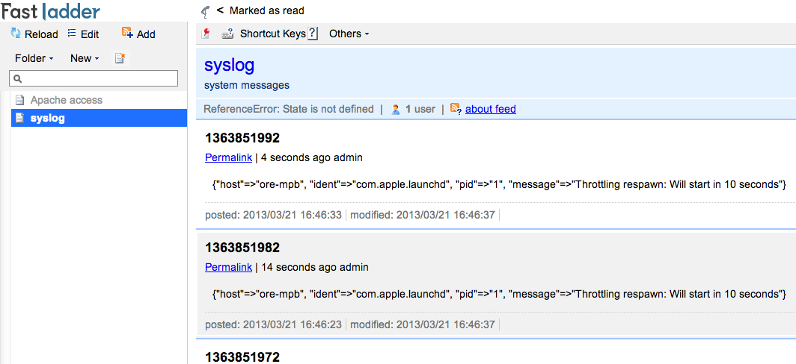

# Fluent::Plugin::Fastladder

## Configuration

    <source>
      type tail
      path /var/log/system.log
      format syslog
      tag feed.syslog
    </source>

    <source>
      type tail
      path /var/log/apache2/access_log
      format apache
      tag feed.apache.access
    </source>

    <match feed.**>
      type fastladder
      base_url http://localhost:3000
      api_key 863e2e2d5dd34dcbb3fb62cf6bdc953f

      <feed>
        key syslog
        title syslog feed
        description system messages
        pattern ^.*.syslog$
        category admin # option
      </feed>
      <feed>
        key apache-access
        title Apache log feed
        description Apache HTTPD access log
        pattern ^.*.apache.*$
      </feed>
    </match>

### base_url(required)
Your Fastladder URL(API base path).

### api_key(required)
Fastladder's API Key.

### feed:key(required)
A unique string for feed.

## Installation

Installing custom plugins
http://docs.fluentd.org/articles/plugin-development

    git clone https://github.com:laiso/fluent-plugin-fastladder.git
    cd fluent-plugin-fastladder
    cp lib/fluent/plugin/out_fastladder.rb /etc/fluent/plugin/

Let's restart Fluentd.

## Development

You should setup Fastladder before development.
https://github.com/fastladder/fastladder

Start Fluentd

    bundle install
    bundle exec rake test
    cp conf/fluentd.conf.sample conf/fluentd.conf
    bundle exec fluentd -c conf/fluentd.conf -p lib/fluent/plugin

It works

    # Add record apache access
    curl http://localhost/

